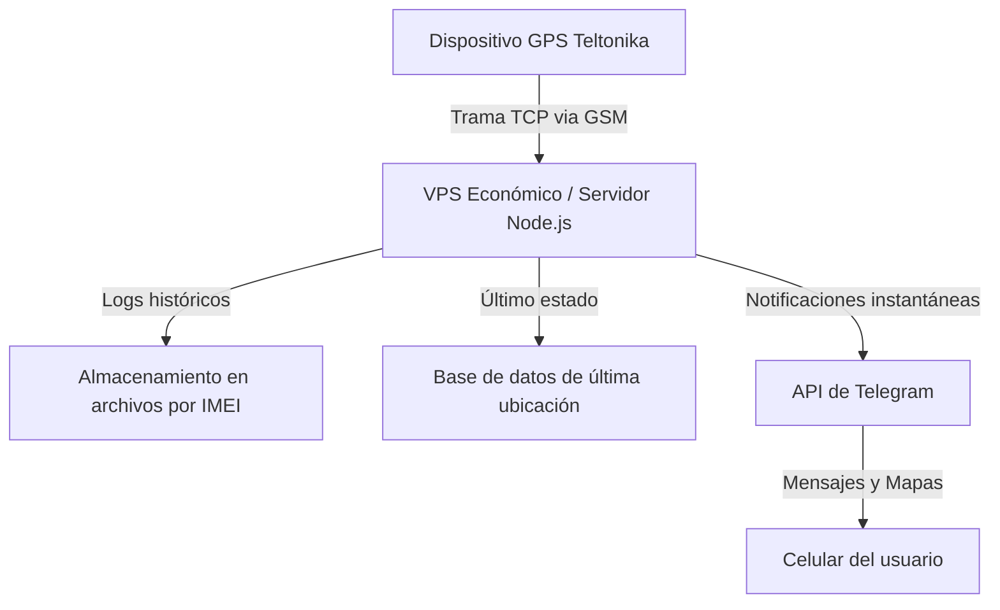

En el año 2021 adquirí un vehículo nuevo. Como es habitual en muchas concesionarias, el auto venía con un dispositivo de rastreo satelital (GPS) preinstalado. En la factura final, este dispositivo de la reconocida marca **Teltonika** figuraba con un costo de **$500 USD**. 

Como desarrollador con curiosidad innata, mi primer instinto fue investigar. Busqué el modelo exacto del GPS en internet y descubrí que su precio de venta al público en el mercado no superaba los **$120 USD**. Pero el abuso comercial no terminaba ahí: la empresa proveedora del servicio de rastreo exigía un pago de **$150 USD anuales** por la renovación de la licencia para usar su plataforma. 

A esta excesiva diferencia de precios se sumó una sorpresa aún peor cuando decidí probar el sistema: **estaba mal instalado**. El circuito que debía notificar la apertura de puertas estaba mal cableado o configurado de tal manera que solo detectaba cuando se abría la puerta principal del chofer. Si alguien abría cualquiera de las otras tres puertas o la cajuela, el sistema simplemente no se enteraba.

En ese momento lo tuve claro: no iba a pagar una suscripción anual por un servicio costoso, mal instalado y limitado. Decidí crear mi propia plataforma de rastreo.

---

## La chispa de la idea: Mi experiencia en Code Plus

Afortunadamente, contaba con un as bajo la manga. Durante mi paso por **Code Plus**, uno de los proyectos que me asignaron consistió precisamente en configurar un servidor Linux con **Node.js** para manejar e interpretar las tramas TCP que emiten los dispositivos de rastreo vía GSM (red celular). 

Los dispositivos GPS no hacen magia; periódicamente emiten un paquete de datos (trama) usando protocolos específicos (como el Codec 8 o Codec 8 Extended de Teltonika) sobre una conexión de red. Esta trama incluye latitud, longitud, velocidad, estado del motor, y eventos de los sensores.

Conocer este flujo técnico de antemano me dio la confianza necesaria para asumir el reto. Sabía que interpretar esos bytes y guardarlos en una base de datos estaba completamente a mi alcance.

---

## La evolución del desarrollo: De Java Sockets a Node.js

El proyecto no nació directamente en JavaScript. Al principio, lo planteé como un reto personal para profundizar en el funcionamiento de la programación de red a bajo nivel y entender a fondo el manejo de **Sockets en Java**. 

Escribí un servidor multihilo en Java que abría un puerto, escuchaba las conexiones y procesaba los flujos de entrada. Funcionó bien como ejercicio de aprendizaje, pero cuando quise llevar el proyecto a una fase de producción ágil, decidí migrar la lógica a **Node.js**.

La naturaleza asíncrona de Node.js orientada a eventos, su excelente soporte nativo para streams y buffers a través del módulo `net`, y la rapidez con la que se pueden integrar librerías de terceros (como bases de datos o APIs de mensajería) lo convertían en la herramienta perfecta para este tipo de carga de trabajo.

Un ejemplo simplificado del servidor TCP básico que procesa las conexiones luce así:

```javascript
import net from 'node:net'

const PORT = 5000

const server = net.createServer((socket) => {
  console.log(`[+] Dispositivo conectado: ${socket.remoteAddress}:${socket.remotePort}`)

  socket.on('data', (buffer) => {
    // Aquí es donde ocurre la magia: interpretar la trama binaria (hexadecimal)
    console.log('Trama binaria recibida:', buffer.toString('hex'))
    
    // El protocolo a menudo requiere que el servidor responda con un acuse de recibo (ACK)
    // para que el GPS sepa que los datos llegaron y borre la trama de su memoria interna.
  })

  socket.on('error', (err) => {
    console.error('Error en el socket:', err.message)
  })

  socket.on('close', () => {
    console.log('[-] Dispositivo desconectado')
  })
})

server.listen(PORT, () => {
  console.log(`Servidor TCP de rastreo escuchando en el puerto ${PORT}`)
})
```

---

## Arquitectura de la Plataforma

Para hacer la plataforma viable, escalable y, sobre todo, económica, diseñé una arquitectura ligera pero robusta:



### 1. Servidor VPS Económico con Gran Almacenamiento
Alquilé un servidor virtual privado (VPS) económico. Dado que no requería un procesador ultrapotente pero sí suficiente espacio para guardar los históricos, prioricé el almacenamiento. 

### 2. Guardado Histórico en Archivos
En lugar de saturar una base de datos relacional con millones de registros de posiciones que rara vez se consultan en el día a día, implementé un sistema donde la plataforma genera un documento independiente por cada **IMEI** (identificador único del dispositivo GPS). Allí se va escribiendo secuencialmente el histórico de tramas a modo de log persistente.

### 3. Última Ubicación en Base de Datos
En otra base de datos paralela, el sistema almacena exclusivamente el **último estado** del vehículo (posición actual, velocidad, estado del motor encendido/apagado). Esto optimiza las consultas en tiempo real y permite que la interfaz web cargue instantáneamente.

### 4. Integración Premium con Telegram
Para evitar la necesidad de desarrollar y mantener una aplicación móvil dedicada (que consume batería y recursos del teléfono), decidí usar la **API de Telegram** como mi centro de control y notificaciones:

* **Eventos del Motor:** Al encender o apagar el vehículo, el servidor procesa el cambio de estado e inmediatamente me envía una alerta a Telegram.
* **Fin de Viaje:** Al detectar que el motor se ha apagado después de un periodo de movimiento, el sistema calcula la duración total del viaje y envía un resumen de viaje finalizado.
* **Ubicación en tiempo real:** Cuando quiero saber exactamente dónde está el auto, el servidor genera una ubicación interactiva usando la función nativa de Telegram de ubicación en tiempo real que **expira automáticamente a las 6 horas**. Esto es sumamente útil para monitorear el trayecto sin sobrecargar el servidor de peticiones continuas.

---

## Estado Actual y el Futuro: ¿Un posible SaaS?

Hoy en día, la plataforma está 100% operativa y estable. Ha pasado de ser un simple experimento técnico a convertirse en una herramienta de uso diario personal y familiar. Nos da la tranquilidad de saber exactamente dónde están nuestros vehículos en todo momento, sin depender de intermediarios y manteniendo un control absoluto de nuestros datos de localización.

Lo mejor de todo es que el costo operativo mensual es ridículamente bajo en comparación con lo que cobraban las empresas tradicionales de seguridad vehicular.

Si bien comenzó como un proyecto casero, no descarto la posibilidad de abrir las puertas de la plataforma a más usuarios en el futuro y convertirlo en un **SaaS (Software as a Service) económico**. Existe un mercado enorme de personas cansadas de pagar tarifas excesivas por plataformas de GPS lentas, obsoletas y con malas instalaciones físicas. 

Desarrollar esta solución no solo me ahorró dinero, sino que me demostró una vez más que la curiosidad y la tecnología adecuada pueden desarmar por completo un modelo de negocio abusivo.
